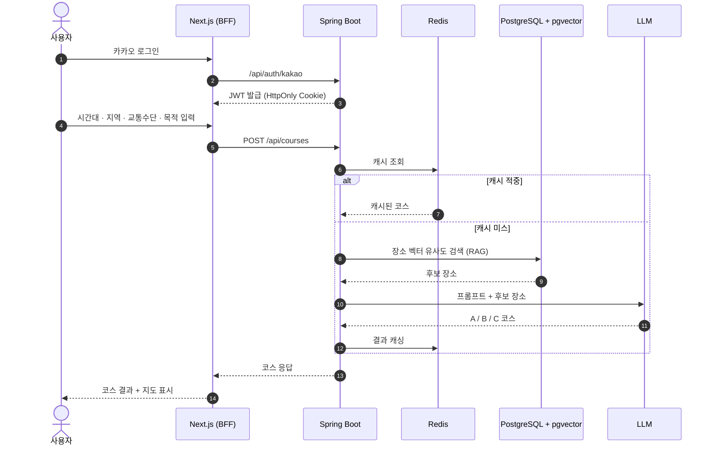
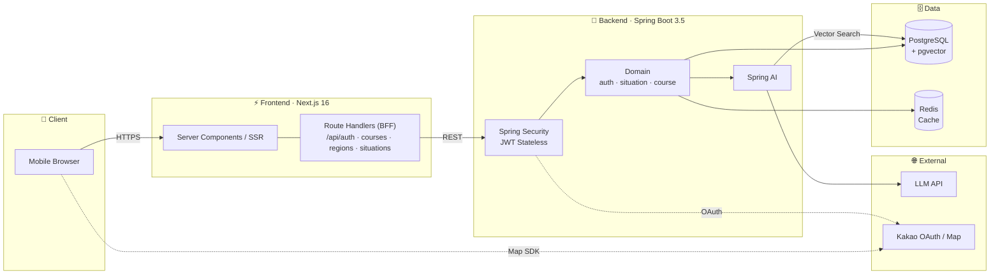
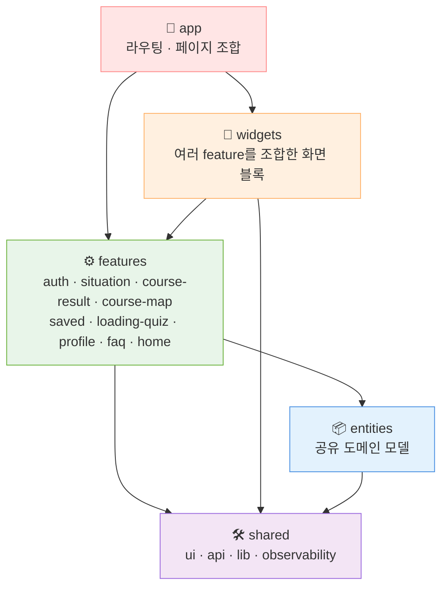
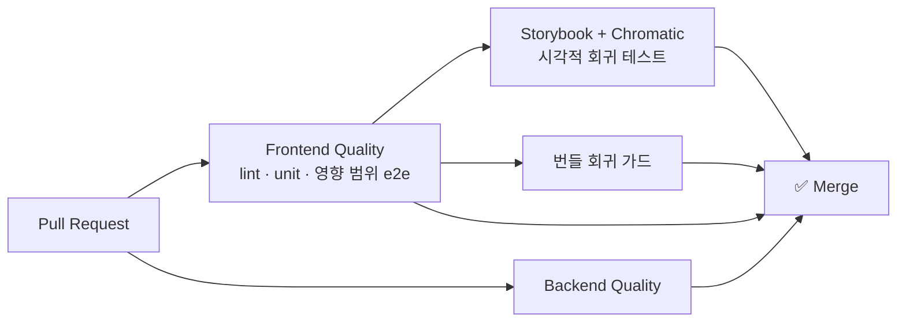

<div align="center">


### 🗺️ 시간 · 지역 · 교통수단 · 목적만 입력하면, AI가 3가지 데이트 코스를 짜드립니다

<br/>


<br/>


</div>

<br/>

## 📌 목차

- [프로젝트 소개](#-프로젝트-소개)
- [주요 기능](#-주요-기능)
- [서비스 흐름](#-서비스-흐름)
- [시스템 아키텍처](#-시스템-아키텍처)
- [프론트엔드 아키텍처 (VSA)](#-프론트엔드-아키텍처-vsa)
- [기술 스택](#-기술-스택)
- [품질 관리](#-품질-관리)
- [시작하기](#-시작하기)
- [팀원](#-팀원)

<br/>

## 💡 프로젝트 소개

> **"오늘 어디 가지?"** 매번 반복되는 데이트 고민을 AI로 해결합니다.

**Dayro**는 사용자의 상황(시간대, 지역, 교통수단, 목적)을 입력받아
생성형 AI가 **성격이 다른 3가지 코스**를 한 번에 추천하는 모바일 웹 서비스입니다.

| 🅐 근거리 코스 | 🅑 SNS 핫플 코스 | 🅒 분위기 코스 |
|:---:|:---:|:---:|
| 이동 부담 없이 가까운 곳 위주 | 요즘 뜨는 인기 장소 위주 | 무드 있는 장소 위주 |

<br/>

## ✨ 주요 기능

| 기능 | 설명 |
|---|---|
| 🔐 **카카오 로그인** | 카카오 OAuth + JWT(Access/Refresh) 기반 인증 |
| 📝 **상황 입력** | 시간대, 지역, 교통수단, 목적을 단계별로 선택 |
| 🤖 **AI 코스 생성** | Spring AI + pgvector RAG로 A/B/C 3가지 코스 생성 |
| 🧩 **로딩 퀴즈** | 코스 생성 대기 시간 동안 즐길 수 있는 미니 퀴즈 |
| 🗺️ **코스 지도** | 카카오맵으로 코스 동선 시각화, 네이버/티맵 길찾기 연동 |
| 💾 **코스 저장·편집** | 저장한 코스를 드래그 앤 드롭(dnd-kit)으로 순서 변경 |
| 👤 **마이페이지 / FAQ** | 프로필, 회원 탈퇴, 자주 묻는 질문, 문의하기 |

<br/>

<!-- 📸 스크린샷을 준비하면 아래 주석을 해제하세요
## 📱 화면 미리보기

| 홈 | 상황 입력 | 코스 결과 | 저장한 코스 |
|:---:|:---:|:---:|:---:|
|  |  |  |  |
-->

## 🔄 서비스 흐름



<br/>

## 🏗️ 시스템 아키텍처



> 클라이언트는 외부 백엔드를 **직접 호출하지 않고**, 항상 Next.js BFF(Route Handler)를 거칩니다.
> 토큰은 BFF에서 HttpOnly 쿠키로만 다뤄서 브라우저에 노출되지 않습니다.

<br/>

## 🧱 프론트엔드 아키텍처 (VSA)

**Vertical Slice Architecture**를 기준으로, 기능 단위로 코드를 세로로 나눴습니다.



<details>
<summary><b>📂 디렉터리 구조 펼치기</b></summary>

```
dayro/
├── frontend/
│   └── src/
│       ├── app/                 # App Router (페이지 + BFF Route Handlers)
│       │   ├── api/             # auth · courses · course-draft · regions · situations
│       │   ├── course/new/      # 코스 생성
│       │   ├── saved/[id]/      # 저장한 코스 상세
│       │   ├── mypage/ faq/ login/ terms/ privacy/
│       ├── widgets/             # 화면 단위 조합 블록
│       ├── features/            # 기능 슬라이스 (ui · model · hooks · api · types · lib)
│       ├── entities/            # 공유 도메인 모델
│       ├── shared/              # 공용 UI · API 클라이언트 · 유틸 · Web Vitals
│       └── mocks/               # MSW 목 핸들러
└── backend/
    └── dayro-backend/
        └── src/main/java/com/dayro/
            ├── auth/            # 카카오 로그인 · JWT
            ├── situation/       # 상황 입력
            ├── course/          # AI 코스 생성 · 저장
            └── global/          # config · error · response · health
```

</details>

**의존 규칙**
- `app`은 feature/widget/shared의 **public API(`index.ts`)** 만 import합니다.
- feature끼리 서로의 내부 파일을 직접 import하지 않습니다.
- `shared`와 `entities`는 feature를 import하지 않습니다.

<br/>

## 🛠 기술 스택

<table>
<tr>
  <td align="center" width="140"><b>Frontend</b></td>
  <td>
    
    
    
    
    
    
  </td>
</tr>
<tr>
  <td align="center"><b>Backend</b></td>
  <td>
    
    
    
    
    
    
    
  </td>
</tr>
<tr>
  <td align="center"><b>Data</b></td>
  <td>
    
    
    
  </td>
</tr>
<tr>
  <td align="center"><b>Test / QA</b></td>
  <td>
    
    
    
    
    
  </td>
</tr>
<tr>
  <td align="center"><b>Infra / Tool</b></td>
  <td>
    
    
    
    
  </td>
</tr>
</table>

<br/>

## ✅ 품질 관리



- **단위 테스트**: Vitest (+ Browser mode)
- **E2E**: Playwright. 변경된 파일에 영향받는 시나리오만 골라 실행 (`e2e-impact-map.json`)
- **UI 컴포넌트**: Storybook + a11y addon + Chromatic
- **성능**: Web Vitals 수집, Lighthouse 기반 LCP·TBT·CLS 개선, 번들 크기 회귀 가드
- **AI 협업 하네스**: Claude(UI/UX) ↔ Codex(로직·리뷰·검증) 역할 분리 (`.agents/`)

<br/>

## 🚀 시작하기

### Frontend
```bash
cd frontend
npm install
npm run dev          # http://localhost:3000
npm run storybook    # http://localhost:6006
```

### Backend
```bash
cd backend/dayro-backend
cp .env.example .env   # 실제 값은 팀에게 전달받기
docker compose up -d   # PostgreSQL + Redis
./gradlew bootRun
```

<br/>

## 👥 팀원

|  |  |  |  |
|:---:|:---:|:---:|:---:|
| **박경찬** | **이원준** | **한혜민** | **박기웅** |
| Frontend | Backend | 기획 | 마케팅 |
| UI/UX · 성능 최적화 | API · AI 코스 생성 | 서비스 기획 | 마케팅 |

<br/>

<div align="center">

</div>
