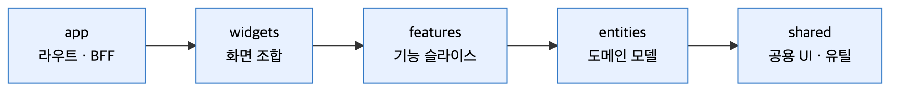
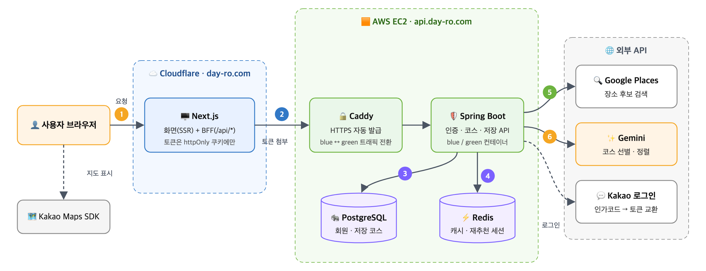
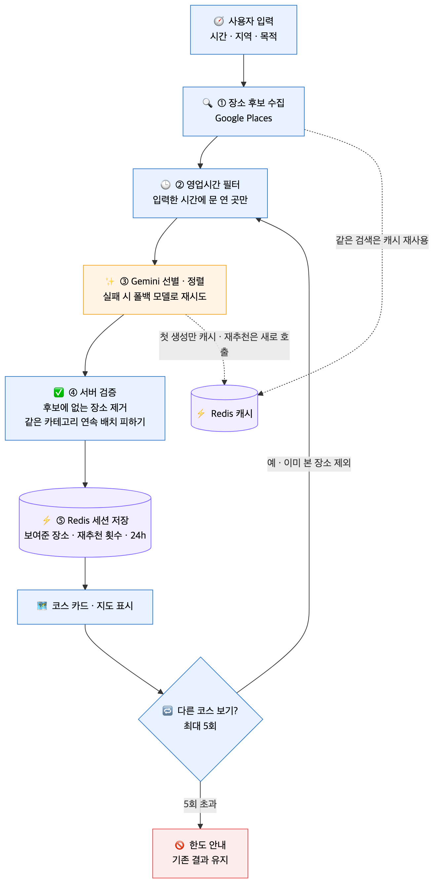
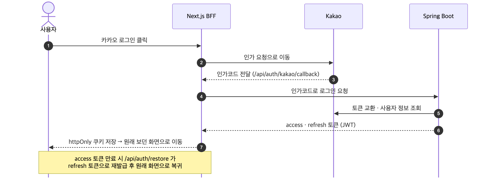
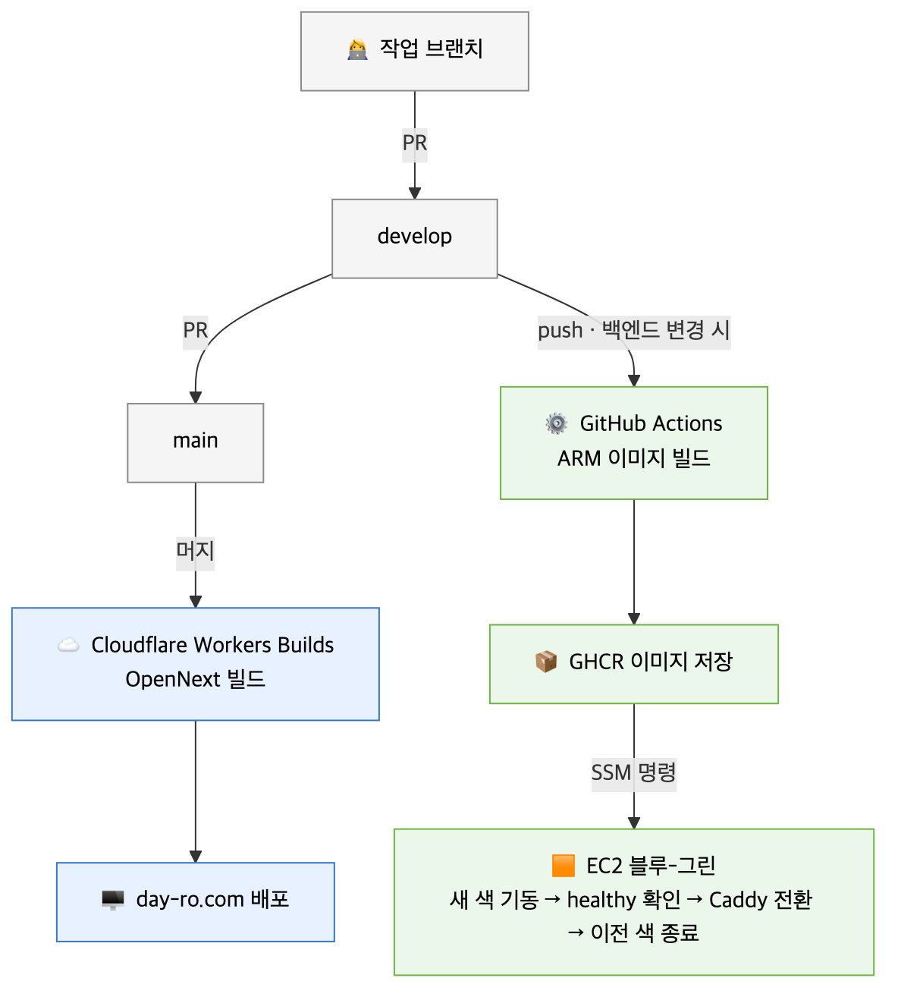

<div align="center">

# 🚕 Dayro

**시간 · 지역 · 목적만 고르면, AI가 오늘의 데이트 코스를 짜주는 웹 서비스**

Google Places로 주변 장소 후보를 모으고 Gemini가 상황에 맞게 골라 순서대로 엮어, 지도와 길찾기까지 한 번에 보여줍니다.

<br>

[🌐 day-ro.com](https://day-ro.com)

<br>


</div>

> [!NOTE]
> 이 저장소는 팀 저장소 `Dayro-dev/dayro`의 **현재 코드 스냅샷 미러**입니다 (커밋 히스토리 제외).

---

## 📑 목차

[프로젝트 현황](#-프로젝트-현황) · [핵심 기능](#-핵심-기능) · [저장소 구조](#️-저장소-구조) · [기술 스택](#-기술-스택) · [시스템 아키텍처](#️-시스템-아키텍처) · [코스 생성 흐름](#-코스-생성-흐름) · [로그인 흐름](#-로그인-흐름) · [프론트엔드 설계 원칙](#-프론트엔드-설계-원칙) · [기술적 도전](#-기술적-도전) · [인프라 · 배포](#️-인프라--배포) · [실행 방법](#️-실행-방법) · [남은 작업](#️-남은-작업)

---

## 📊 프로젝트 현황

<sup>업데이트: **2026-10-10**</sup>

> **운영 배포 v1 완료** — `https://day-ro.com`에서 `로그인 → 상황 입력 → AI 코스 생성·재추천 → 지도·길찾기 → 저장·공유`까지 **전 구간 동작**합니다.
> 남은 작업은 **분석 ID 발급(GA4·Meta)**, **Gemini 유료 전환**, **보안 강화(HSTS·WAF·CSP 강제)** 입니다.

| 영역 | 진행 |
| --- | --- |
| 🧩 기능 프로젝트 | **10 / 12 완료** · 2 진행 중 (운영 배포 마무리 · 마케팅 계측) |
| 🔗 머지된 PR | **100+** (FE · BE) |
| 🧪 FE 단위 테스트 | **775개 통과** (Vitest) + Playwright e2e |
| 🚀 운영 | FE Cloudflare Workers · BE AWS EC2 블루-그린 무중단 |

### 기능별 상태

| 기능 | 상태 | 파트 | 대표 이슈 · PR |
| --- | --- | --- | --- |
| 🔐 카카오 로그인 · 회원 · 탈퇴 | ✅ 완료 | FE · BE | #39·PR#40 / #44 / #90 / #131 |
| 🧭 상황 입력 3단계 | ✅ 완료 | FE · BE | #17 / #48 / #50 / #60 / #69 |
| ✨ AI 코스 생성 · 다른 코스 보기 | ✅ 완료 | FE · BE | #79 / #85 / #126 / #135 / #143 |
| 🗺️ 코스 결과 · 지도 · 네이버 길찾기 | ✅ 완료 | FE | #54 / #81 |
| 💾 코스 저장 · 수정 · 삭제 · 공유 | ✅ 완료 | FE · BE | #75 / #95 / #110 / #113 |
| 📄 마이페이지 · FAQ · 약관 | ✅ 완료 | FE | #37 / #56 / #108 |
| 🧱 프로젝트 기반 · 디자인 시스템 | ✅ 완료 | 공통 | #4 / #6 / #8 / #29 / #133 |
| ⚡ 성능 최적화 | ✅ 완료 | FE | #97 / #99 / #115 / #119 |
| 🛡️ 보안 점검 · CSP 수집 | ✅ 완료 | FE | #139 / #141 |
| 📈 마케팅 유입 계측 (UTM · GA4 · Meta) | 🟡 진행 중 | FE | #125 (코드 완료, ID 발급 대기) |
| 🚀 운영 배포 | 🟡 진행 중 | FE · BE | PR#124 / #146 (운영 중, 보안 설정 마무리) |
| 🤖 AI 에이전트 협업 하네스 | ✅ 완료 | 공통 | #73 / #83 / #103 / #105 |

<sup>범례: ✅ 완료 · 🟡 진행 중 · ⬜ 대기</sup>

---

## ✨ 핵심 기능

1. **🧭 상황 입력** — 시간대 · 지역(시·구·동 검색) · 목적을 3단계로 선택. 로딩 중에는 초성 퀴즈로 기다림을 줄입니다.
2. **✨ AI 코스 생성** — Google Places 후보 장소를 Gemini가 상황에 맞게 골라 순서대로 엮은 코스를 추천. 마음에 들지 않으면 **다른 코스 보기 최대 5회**
3. **🗺️ 지도 · 길찾기** — 카카오맵에 코스 동선을 표시하고, 확정한 코스는 네이버 길찾기로 바로 연결
4. **💾 저장 · 공유** — 코스를 저장하고 한 줄 설명 수정 · 삭제, 네이버지도 길안내 링크로 공유
5. **🔐 카카오 로그인** — 인가코드 방식 로그인, 로그인 후 원래 보던 화면으로 복귀

---

## 🗂️ 저장소 구조

FE와 BE를 한 저장소에서 관리합니다. 브라우저는 백엔드를 직접 호출하지 않고 **Next.js BFF(`/api/*`)를 거칩니다.**

```
dayro/
├─ frontend/                  # 🖥️ Next.js 16 — 화면 + BFF
│  └─ src/
│     ├─ app/                 # 라우트 · Route Handler(BFF) · 레이아웃
│     ├─ widgets/             # 여러 feature를 조합한 화면 블록
│     ├─ features/            # 기능 슬라이스 (auth · situation · course-result · course-map · saved · faq …)
│     ├─ entities/            # 공유 도메인 모델
│     └─ shared/              # 공용 UI · API 클라이언트 · 분석 · 유틸
├─ backend/dayro-backend/     # 🛡️ Spring Boot API
│  ├─ src/main/java/com/dayro/
│  │  ├─ auth/                # 카카오 로그인 · JWT
│  │  ├─ situation/           # 지역 · 상황 마스터
│  │  ├─ course/              # 코스 생성 · 재추천 · 저장
│  │  ├─ activity/
│  │  └─ global/              # 보안 설정 · 예외 · 공통 응답
│  ├─ compose.yaml            # 로컬 PostgreSQL(pgvector) · Redis
│  └─ compose.prod.yaml       # 운영 Caddy · backend-blue/green · DB · Redis
└─ .github/workflows/         # ✅ PR 품질 검사 · 백엔드 자동 배포
```

> **레이어 규칙** — `app → widgets → features → entities → shared` 방향으로만 import합니다. feature끼리 내부 파일을 직접 import하지 않고, 공개 API(`index.ts`)만 사용합니다.

<p align="center"></p>

---

## 🧱 기술 스택

| 구분 | 기술 | 역할 |
| --- | --- | --- |
| 프론트엔드 | Next.js 16 (App Router) · React 19 · TypeScript | SSR 화면 + BFF Route Handler |
| 검증 | Zod (zod/mini) | BFF ↔ 백엔드 응답 런타임 검증 |
| 지도 | Kakao Maps JavaScript SDK | 코스 동선 표시 |
| 테스트 | Vitest · Playwright · Storybook · Chromatic | 단위 · e2e · UI 카탈로그 · 시각 회귀 |
| 백엔드 | Spring Boot 3.5 · Java 21 · Spring Security(JWT) | 인증 · 코스 · 저장 API |
| AI | Spring AI 1.1 · Google Gemini | 장소 후보 선별 · 코스 구성 (폴백 모델 재시도) |
| 장소 데이터 | Google Places API | 지역별 장소 후보 수집 |
| 데이터 | PostgreSQL 16 + pgvector · Redis 7 | 사용자 · 코스 저장 · 캐시 |
| FE 배포 | Cloudflare Workers · OpenNext | 엣지 SSR · `main` 머지 시 자동 배포 |
| BE 배포 | AWS EC2 · Docker Compose · Caddy · GHCR · SSM | 블루-그린 무중단 배포 · HTTPS 자동 발급 |

---

## 🏗️ 시스템 아키텍처

> **한 줄 요약** — 사용자는 Cloudflare 위의 Next.js와만 이야기합니다. Next.js(BFF)가 쿠키 속 토큰을 꺼내 AWS의 Spring Boot를 대신 호출하고, Spring Boot는 Google Places와 Gemini로 코스를 만들어 돌려줍니다.

<p align="center"></p>

**동작 순서 (그림의 번호와 동일)**

1. **브라우저 → Next.js** — 화면과 데이터 요청은 모두 `day-ro.com`(Cloudflare)으로 갑니다. 브라우저는 백엔드 주소를 모릅니다.
2. **Next.js → Spring Boot** — BFF가 httpOnly 쿠키의 토큰을 꺼내 `api.day-ro.com`을 호출합니다. *(토큰은 브라우저 자바스크립트에 노출되지 않음)*
3. **PostgreSQL** — 회원 · 저장한 코스를 보관합니다.
4. **Redis** — 외부 API 결과 캐시와 "다른 코스 보기" 세션(24시간)을 보관합니다.
5. **Google Places** — 지역 · 목적에 맞는 장소 후보를 가져옵니다.
6. **Gemini** — 후보 중에서 상황에 맞는 장소를 골라 순서대로 정렬합니다.

> 📌 **왜 BFF를 두었나** — ① 토큰을 서버에만 두어 XSS로부터 보호 ② 백엔드 응답을 zod로 검증한 뒤 화면에 전달 ③ 백엔드 주소 · 키를 브라우저에 노출하지 않음

---

## 🔄 코스 생성 흐름

> **한 줄 요약** — 장소 후보를 모으고 → 영업 중인 곳만 남기고 → Gemini가 고르고 → 서버가 한 번 더 검증한 뒤 코스를 돌려줍니다. 결과는 Redis 세션에 기록해 "다른 코스 보기" 때 이미 본 장소를 피합니다.

<p align="center"></p>

**포인트**

- **비용 · 속도** — 같은 지역 검색은 Places 결과를 Redis 캐시로 재사용합니다. 재추천 때 Gemini는 캐시를 건너뛰어 매번 다른 결과를 받습니다.
- **AI 결과를 그대로 믿지 않음** — Gemini가 후보 목록에 없는 장소 ID를 돌려주면(할루시네이션) 서버에서 제외합니다.
- **장애 대응** — 기본 Gemini 모델이 실패하면 폴백 모델로 한 번 더 시도합니다.
- **로그인 없이도 재추천** — `requestId`로 Redis 세션을 찾기 때문에 비로그인 사용자도 "다른 코스 보기"를 쓸 수 있습니다.
- **FE 실패 처리** — 재추천이 실패해도 화면의 기존 코스와 남은 횟수는 그대로 유지합니다.

---

## 🔐 로그인 흐름

> **한 줄 요약** — 카카오가 돌려준 인가코드를 BFF가 받아 백엔드에서 토큰으로 바꾸고, 토큰은 **httpOnly 쿠키**로만 보관합니다.

<p align="center"></p>

- **③ 콜백을 FE가 받는 이유** — 토큰이 브라우저 주소창 · 자바스크립트를 거치지 않고 서버에서 바로 쿠키로 저장됩니다.
- **⑦ 원래 화면 복귀** — 로그인 전 보던 경로(`next`)를 검증해 외부 주소로의 이동(open redirect)을 막습니다.

---

## 🧭 프론트엔드 설계 원칙

| 원칙 | 내용 |
| --- | --- |
| BFF 경유 | 브라우저 → 백엔드 직접 호출 금지. 토큰은 서버(BFF)에서만 다룸 |
| 런타임 검증 | 백엔드 응답은 zod 스키마로 검증 후 화면에 전달 |
| 서버 상태 우선 | 서버 데이터가 기준, 클라이언트는 입력 흐름 · 화면 상태만 관리 |
| 보안 헤더 | CSP(report-only 수집) · HSTS 준비 · 보호 라우트 세션 검사 |
| 성능 예산 | 라우트별 번들 예산을 CI에서 검사해 회귀 차단 |
| 접근성 | 시맨틱 마크업 · 포커스 · 대비 기준 문서화 |

---

## 💪 기술적 도전

### ☁️ Cloudflare Workers 이전 — Worker 번들 42% 감량

- **문제** — OpenNext로 빌드하자 Next.js Node 미들웨어(`proxy.ts`)가 통째로 번들에 들어가 Worker 크기가 무료 한도의 98%에 도달
- **해결** — 미들웨어를 제거하고 세션 복구를 Route Handler(`/api/auth/restore`)와 서버 컴포넌트 가드로 이전
- **결과** — Worker gzip **3,004KiB → 1,737KiB (-42%)**, 단위 테스트 775개 통과 (#146)

### ⚡ 성능 최적화

- 코스 추천 **중복 요청 제거** · 홈 초기 렌더 비용 정리 (#97)
- **Web Vitals 계측** 도입 · 홈 이미지 전송 · TTFB 개선 (#99)
- 로딩 CTA 삽입으로 생기던 **CLS 제거** · `next/dynamic` 코드 분할 (#115)
- zod → zod/mini 전환 · 미사용 폰트 제거 · **번들 회귀 가드** (#119)

### 🛡️ 배포 전 보안 점검

- 토큰 노출 · 경로 조작 · Next.js 취약 버전 · 보안 헤더 · BFF 오류 응답 규칙 점검 및 조치 (#139)
- CSP 위반 리포트 수집 경로(`/api/csp-report`) + 보안 헤더 회귀 테스트 (#141)

### 🧩 상태 구조 개선

- 코스 만들기 상태를 URL에서 분리해 흐름 store로 이전 (#129)
- 컴포넌트 · 컨트롤러 역할 분리와 커스텀 훅 모듈화 (#133)

---

## ☁️ 인프라 · 배포

<p align="center"></p>

- **BE** — 새 버전을 반대 색 컨테이너로 띄우고, healthy 확인 후 Caddy가 트래픽을 넘깁니다. 새 버전이 실패하면 이전 색이 그대로 서비스합니다. *(무중단)*
- **FE** — `develop → main` PR 머지가 곧 운영 배포입니다.

| 구성 | 위치 | 배포 방식 |
| --- | --- | --- |
| 🖥️ Frontend (Next.js) | Cloudflare Workers · `day-ro.com` | `main` 머지 → Workers Builds 자동 빌드·배포 |
| 🛡️ Backend (Spring Boot) | AWS EC2 · `api.day-ro.com` | `develop` push → GitHub Actions → GHCR → SSM → 블루-그린 전환 |
| 🔒 HTTPS | Caddy (BE) · Cloudflare (FE) | Let's Encrypt 자동 발급 · 엣지 TLS |
| 🐘 PostgreSQL · ⚡ Redis | EC2 Docker Compose | 컨테이너 운영 |

**PR 품질 검사**

- `frontend-quality` — lint · build · 라우트 번들 예산 · tsc · e2e · Chromatic
- `backend-quality` — `./gradlew build` (Testcontainers 테스트 포함)

---

## ▶️ 실행 방법

### Backend

```bash
cd backend/dayro-backend
cp .env.example .env      # 실제 키는 팀에게 별도로 전달받기
docker compose up -d      # PostgreSQL(pgvector) · Redis
./gradlew bootRun         # http://localhost:8080/health
```

### Frontend

```bash
cd frontend
npm ci
npm run dev               # http://localhost:3000
```

`frontend/.env.local`에 `BACKEND_API_BASE_URL` · `KAKAO_REST_API_KEY` · `NEXT_PUBLIC_KAKAO_MAP_API_KEY` 등을 설정합니다.

| 명령어 | 용도 |
| --- | --- |
| `npm run test:unit` | 단위 테스트 (Vitest) |
| `npm run test:e2e` | e2e 테스트 (Playwright) |
| `npm run storybook` | 공용 UI 카탈로그 |
| `npm run cf:preview` | Cloudflare Workers 런타임으로 로컬 확인 |

---

## 🗺️ 남은 작업

| # | 작업 | 상태 |
| --- | --- | --- |
| 1 | GA4 · Meta Pixel ID 발급 → 운영 빌드 변수 반영 · 이벤트 확인 | 🟡 진행 중 |
| 2 | Gemini 유료 전환 · 운영 코스 생성 한도 조정 | ⬜ 대기 |
| 3 | `www` → `day-ro.com` 리다이렉트 · `workers.dev` 비활성화 | ⬜ 대기 |
| 4 | HSTS · WAF 요청 빈도 제한 · CSP 강제 모드 전환 | ⬜ 대기 |

---

<sub>📐 다이어그램 원본: <code>docs/diagrams/</code> (mermaid <code>.mmd</code> · 아키텍처 <code>.svg</code>)</sub>

<div align="center">
<sub>🤖 프론트엔드는 Claude Code · Codex 두 AI가 동일한 규칙(<code>frontend/AGENTS.MD</code>)으로 역할을 나눠 협업하는 <b>에이전틱 엔지니어링</b> 방식으로 개발했습니다.</sub>
</div>
